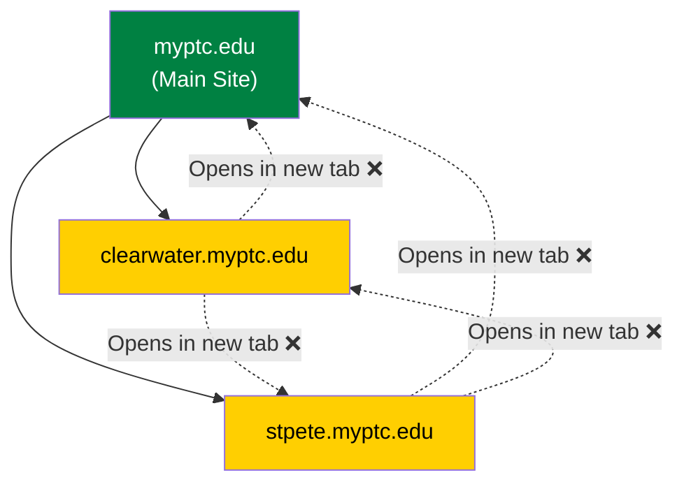
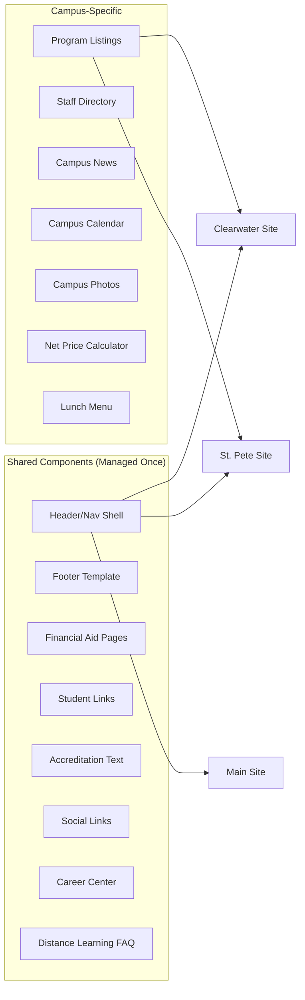

# Pinellas Technical College — Comprehensive Website Audit & Redesign Proposal

**Prepared for:** PTC Web Team
**Date:** March 26, 2026
**Sites Audited:** [myptc.edu](https://www.myptc.edu) · [clearwater.myptc.edu](https://clearwater.myptc.edu) · [stpete.myptc.edu](https://stpete.myptc.edu)
**Platform:** Finalsite

---

## Executive Summary

This audit evaluates all three PTC websites against the official brand guide, modern UX/UI principles, COE accreditation requirements, and Finalsite platform best practices. The sites are functional but suffer from **incorrect brand implementation** (wrong fonts, wrong green), **deeply nested and cluttered navigation**, **duplicated content across all three sites**, and a **dated visual design** that does not reflect current web standards. Below is a detailed analysis and phased proposal for improvement.

---

## 1. Brand Compliance Audit

### 1.1 Official Brand Guide Specifications

| Element | Preferred (Adobe) | Free Alternative (Google) |
|---|---|---|
| **Headline Font** | Elizeth | Roboto Slab |
| **Body Font** | Proxima Nova | Roboto |
| **Logo Green** | #008142 (PMS 348) | RGB: 0, 129, 66 |
| **Logo Yellow** | #FFCF01 (PMS 115) | RGB: 255, 207, 1 |
| **OWI-BIS Green** | #8DC63F (PMS 375) | RGB: 141, 198, 63 |

### 1.2 Current Implementation vs. Brand Guide

| Element | Brand Guide | Current Site | Status |
|---|---|---|---|
| **Headline Font** | Elizeth / Roboto Slab | Playfair Display | ❌ Wrong |
| **Body Font** | Proxima Nova / Roboto | Mulish | ❌ Wrong |
| **Primary Green** | #008142 | #278406 | ❌ Wrong shade |
| **Primary Yellow** | #FFCF01 | Appears close | ⚠️ Verify |
| **Logo Usage** | Vertical/Horizontal approved | Logo present, needs color verification | ⚠️ Check |
| **Font Consistency** | Single system across all sites | Mixed fonts across pages | ❌ Inconsistent |

> [!CAUTION]
> **The entire site is using the wrong typefaces and primary green.** This is the most fundamental brand violation and should be corrected first in any redesign.

### 1.3 Brand Guide Reference

````carousel

<!-- slide -->

````

---

## 2. Navigation & Information Architecture Audit

### 2.1 Main Site (myptc.edu) — Current Navigation Map

The main site uses a **tiered navigation system** with 4 separate navigation zones:

1. **Top Utility Bar:** Translate · Social Icons · District Home · Campuses
2. **Secondary Bar:** Student Record Request · Post a Job · Student Links (Canvas, SIS, Bookstore) · Search · MENU button
3. **Side Action Panel:** Inquire · Apply · STP Dual Enrollment · CLW Dual Enrollment
4. **Hamburger Menu:** Contains the full site navigation

**Issues Identified:**
- ❌ **No visible primary navigation bar** — all navigation is hidden behind a hamburger menu on desktop, which is an anti-pattern for institutional sites
- ❌ **"About Us" menu has 12+ items** nested 3 levels deep under "Welcome to PTC!"
- ❌ **"Resources" menu mixes unrelated items** (Student Resources Guide, Career Center, Community Involvement, Unemployment Info)
- ❌ **Redundant links** — "Campuses" appears in utility bar AND a separate dropdown, calendar appears multiple times
- ❌ **"We Hire PTC: PTC Works!"** is a standalone top-level nav item that would be better under About or Resources
- ❌ **Compliance/legal items buried under "About Us"** (Sexual Misconduct, Financial Reports) — these need to be accessible but are inappropriately placed

### 2.2 Campus Sites (Clearwater & St. Pete) — Current Navigation Map

Both campus sites have a **completely different navigation structure** than the main site:

| Nav Item | Clearwater | St. Pete |
|---|---|---|
| Welcome | Welcome to PTC - Clearwater | Welcome to PTC - St. Petersburg |
| Calendar | PTC-Clearwater Campus Calendar | PTC-St. Petersburg Campus Calendar |
| Admissions | ✅ Full submenu | ✅ Full submenu (slight variation) |
| Programs | ✅ Campus-specific listings | ✅ Campus-specific listings |
| Campus Life | ✅ | ✅ |
| About PTC | ✅ | ✅ |
| Contact | ✅ | ✅ |

**Issues Identified:**
- ❌ **"Admissions > Admissions" redundant nesting** — e.g., `/admissions/admissions/acceptable-proofs-of-residency`
- ❌ **"Shadowing Days & Times" exists on Clearwater but NOT St. Pete**
- ❌ **"Student Services and Hours" (CLW) vs. "Student Services Hours" (STP)** — inconsistent naming
- ❌ **Programs are listed in a flat mega-list** (25+ programs) with no categorization by industry or career cluster
- ❌ **Short Courses link to main site workforce innovation page** — breaks the campus-specific experience
- ❌ **"QuickLinks" placeholder URL** on campus sites (`/link-one`, `/link-two`, `/link-three` on St Pete)
- ❌ **Distance Learning pages are duplicated** between campuses with identical content about "Is Online Learning Right for Me"

### 2.3 Cross-Site Architecture Issue



- ❌ **Campus links open in new tabs** — this creates a confusing multi-window experience
- ❌ **"Return to MyPTC.edu"** link on campus sites feels like you've left the ecosystem
- ❌ **No unified navigation system** — a user on the main site has a completely different experience than on campus sites

---

## 3. Visual Design & UX/UI Audit

### 3.1 Main Site Homepage

````carousel

<!-- slide -->

<!-- slide -->

<!-- slide -->

````

**Issues Identified:**

| Category | Issue | Severity |
|---|---|---|
| **Hero** | Image slider with no clear headline or CTA — "Opportunity starts here" is small and easily missed | 🔴 High |
| **Color Blocks** | Large flat green/yellow sections feel dated (early 2010s aesthetic) | 🟡 Medium |
| **Campus CTAs** | "VISIT CLEARWATER CAMPUS" / "VISIT St. Petersburg CAMPUS" buttons use heavy box shadows and look dated | 🟡 Medium |
| **Quick Links** | Icon grid (Calendar, Books, Fees) is functional but visually basic | 🟡 Medium |
| **Guiding Principles** | Yellow background with serif font feels disconnected from rest of site | 🟡 Medium |
| **News Cards** | No visual cards — news items are raw text blocks with no images or structure | 🔴 High |
| **Events** | "Term 4 - Drop period/refund available" repeated 9 times identically | 🔴 High |
| **Footer** | Busy Skyway Bridge background image makes white text hard to read | 🟡 Medium |
| **Whitespace** | Very little breathing room between sections | 🟡 Medium |
| **Mobile** | Hamburger-only nav on desktop removes discoverability | 🔴 High |

### 3.2 Campus Sites

````carousel

<!-- slide -->

<!-- slide -->

<!-- slide -->

<!-- slide -->

<!-- slide -->

````

**Issues Identified:**

| Category | Issue | Severity |
|---|---|---|
| **Layout** | "In This Section" left sidebar consumes 25-30% of content width | 🟡 Medium |
| **News** | Copy-pasted news blocks with no images, no structured cards | 🔴 High |
| **Events** | Same "Term 4 - Drop period/refund available" repeated 9x bug | 🔴 High |
| **Social Links** | Twitter/X link is broken on St. Pete (no URL), YouTube broken on Clearwater | 🔴 High |
| **St Pete Lunch Menu** | URL is `/menus/clw-menu-clone` — clearly a clone of the Clearwater menu | 🔴 High |
| **Placeholder URLs** | St. Pete uses `/link-one`, `/link-two`, `/link-three` for QuickLinks items | 🔴 High |
| **Typography** | Same off-brand fonts as main site | 🔴 High |
| **Visual Consistency** | Both campus sites look identical to each other in structure but differ from the main site | 🟡 Medium |

---

## 4. Content & Duplication Audit

### 4.1 Content That Should Be Shared (Not Duplicated)

These items contain identical or near-identical content across campuses and should be managed from the main site or a shared Finalsite component:

- Financial Aid policies (FAFSA, Federal/State Funding, Scholarships, Refund Policy, Veterans Benefits)
- Accreditation statement (COE/Cognia footer text — identical on all 3 sites)
- Student Links (Canvas, SIS Portal, Bookstore — same links on all sites)
- Career Center, Career Exploration, Post a Job
- Distance Learning FAQ pages ("Is Online Learning Right for Me", "How do online classes work")
- Compliance statements (Sexual Misconduct, Law Enforcement notices)
- Articulation Agreements page
- Social media links (same accounts across all sites)
- Calendar downloads (same resource ID `ad3ce723-d3f5-41fb-bda2-b8b5f0d25341` across all 3 sites!)

### 4.2 Content That Must Be Campus-Specific (COE Requirement)

- Program listings (each campus has different program offerings)
- Campus-specific admissions info (Shadowing days differ, contact numbers differ)
- Net Price Calculator (different for each campus)
- Campus calendar
- Staff/Faculty directory
- Campus-specific news and achievements
- Lunch menus
- Campus location / address / phone
- Campus-specific student organizations (if membership differs)

### 4.3 COE Accreditation — Per-Campus Website Requirements

> [!IMPORTANT]
> PTC's footer states: *"Each Pinellas Technical College campus is **individually accredited** by the Council on Occupational Education."* This means COE evaluates each campus website **separately** during accreditation review. The following content **MUST exist on each campus site independently** — it cannot simply link to the main site.

Based on COE Standards of Accreditation (Handbook, 2025 Edition) and federal consumer information disclosure requirements:

| # | Required Disclosure | Standard/Basis | Must Be Campus-Specific? |
|---|---|---|---|
| 1 | **Accreditation status** with COE's full name, address, phone, and website (council.org) | COE Policy | ✅ Yes — each campus must state its own accreditation |
| 2 | **Mission statement** | Standard 1 | Can be shared if mission is institutional |
| 3 | **Program listings** with descriptions, length, prerequisites, costs | Standard 2 | ✅ Yes — each campus has different programs |
| 4 | **CPL Data** — Completion rates, Placement rates, Licensure pass rates | Standard 3 | ✅ **Yes — cannot be combined across campuses** |
| 5 | **Student outcomes / achievement data** | Standard 3 | ✅ Yes — per campus |
| 6 | **Financial aid information** (FAFSA, costs of attendance, refund policy) | Federal (HEA/HEOA) | ✅ Yes — Net Price Calculator is campus-specific |
| 7 | **Admissions requirements** and enrollment procedures | Standard 5 | ✅ Yes — shadowing days/process may differ |
| 8 | **Student services** information and hours | Standard 5 | ✅ Yes — hours/contacts differ by campus |
| 9 | **Grievance/complaint policies** and procedures | COE Condition | Can share policy text, but contact info must be campus-specific |
| 10 | **Campus safety / Clery Act** crime statistics | Federal (Clery Act) | ✅ Yes — campus-specific data |
| 11 | **FERPA** (student privacy rights) | Federal | Can be shared |
| 12 | **Catalog** (online or downloadable) with program details | COE Condition | ✅ Yes — must reflect campus-specific offerings |
| 13 | **Faculty qualifications** / staff directory | Standard 4 | ✅ Yes — per campus |
| 14 | **Physical facilities** accurately portrayed | COE Policy | ✅ Yes — campus photos/descriptions |
| 15 | **Drug and alcohol abuse prevention** program info | Federal | Can be shared |
| 16 | **Transfer of credit** policies and articulation agreements | Standard 2 | Can be shared if institutional policy |
| 17 | **Non-discrimination / compliance** statements | Federal/State | Can be shared |

> [!WARNING]
> **Row 4 (CPL Data) is the most critical item.** COE explicitly states that Completion, Placement, and Licensure data "cannot be combined across campuses." Each campus site needs its own outcomes/scorecard page with campus-specific rates. This data is currently **not visible** on either campus website.

#### What This Means for the Redesign

- **Campus sites must be robust, standalone sites** — they cannot be "light" subdomains that just link back to the main site
- **At minimum 17 content areas must exist on each campus site** (some can share identical policy text, but many require campus-specific data)
- **The main site can serve as a "portal"** that routes visitors to the correct campus, houses shared institutional info (mission, compliance), and provides the brand umbrella
- **Consider adding a "Consumer Information" or "Student Right to Know" page** to each campus site that consolidates all required federal/COE disclosures in one place — many COE-accredited schools do this

### 4.4 Content Quality Issues

- **News items lack images** — plain text blocks instead of structured cards with thumbnails
- **Events widget is broken** — shows same event repeated 9 times
- **"NTHS" stoles description** appears on all 3 sites as a standalone news item without context
- **Graduation information** is identical across both campus sites — could be centralized with date/location variables
- **CPL data / student outcomes are not published** on any of the 3 sites — this is a potential COE compliance gap

---

## 5. Technical & Accessibility Issues

| Issue | Location | Severity |
|---|---|---|
| Broken Twitter/X social link (no href) | stpete.myptc.edu footer | 🔴 |
| Broken YouTube social link (no href) | clearwater.myptc.edu footer | 🔴 |
| St Pete lunch menu URL is `/menus/clw-menu-clone` | stpete.myptc.edu footer | 🔴 |
| Placeholder URLs (`/link-one`, `/link-two`, `/link-three`) | stpete.myptc.edu header | 🔴 |
| "LInkedIn" typo (capital I) | stpete.myptc.edu footer | 🟡 |
| `[Career Center](link)` nested inside another `[Career Center](link)` | myptc.edu nav | 🟡 |
| Footer accreditation text is a single long italic paragraph — hard to read | All sites | 🟡 |
| Missing `alt` text verification needed on images | All sites | ⚠️ TBD |
| OG Description just says "Home - Pinellas Technical College" — not descriptive | All sites | 🟡 |
| Events calendar "Read More" links point to the homepage (`/`) | All sites | 🔴 |

---

## 6. Redesign Proposal

### Phase 1: Navigation & Information Architecture Restructure

#### 6.1 Main Site — Proposed Navigation

```
┌──────────────────────────────────────────────────────────────────┐
│ [Logo]  Pinellas Technical College  |  CLW Campus  |  STP Campus │
│         Opportunity starts here     |  INQUIRE  |  APPLY         │
├──────────────────────────────────────────────────────────────────┤
│  Programs ▼  │  Admissions ▼  │  Campus Life ▼  │  About  │  🔍 │
└──────────────────────────────────────────────────────────────────┘
```

**Proposed Top-Level Structure:**

| Current | Proposed | Rationale |
|---|---|---|
| About Us > Welcome to PTC > (12 items) | **About** (flat, 4-5 items) | Remove nesting; move compliance to footer |
| Resources (mixed bag) | **Campus Life** | Student-oriented: Career Center, Student Orgs, Student Resources |
| Workforce Innovation | **Programs** (mega-menu) | Combine with campus programs, grouped by career cluster |
| We Hire PTC | Move under **About** or **Campus Life** | Not important enough for top-level nav |
| (none) | **Admissions** | Promote to main site — currently only on campus sites |

#### 6.2 Campus Sites — Proposed Navigation

Keep campus-specific data (programs, staff, calendar, news) but **share the navigation shell**:

```
┌──────────────────────────────────────────────────────────────────┐
│ [Logo]  PTC — Clearwater Campus     |  Main Site  |  STP Campus  │
│         727.538.7167                |  INQUIRE    |  APPLY        │
├──────────────────────────────────────────────────────────────────┤
│  Programs ▼  │  Admissions ▼  │  Campus Life ▼  │  About  │  🔍 │
└──────────────────────────────────────────────────────────────────┘
```

- Same navigation structure as main site, but **Programs** shows campus-specific listings
- **Admissions** shows campus-specific details (shadowing, net price calculator)
- Campus switcher integrated into header vs. "Return to MyPTC.edu"

### Phase 2: Branding & Visual Design Overhaul

#### 6.3 Typography Correction
- Replace Playfair Display → **Roboto Slab** (Free) or **Elizeth** (Adobe, if licensed)
- Replace Mulish → **Roboto** (Free) or **Proxima Nova** (Adobe, if licensed)
- Implement a Finalsite-wide font stack via the global theme

#### 6.4 Color System Correction

| Token | Current | Corrected |
|---|---|---|
| `--ptc-green` | #278406 | **#008142** |
| `--ptc-yellow` | (varies) | **#FFCF01** |
| `--ptc-green-light` | (none) | **#8DC63F** |
| `--ptc-white` | #FFFFFF | #FFFFFF |
| `--ptc-dark` | (varies) | **#1A1A1A** |

#### 6.5 Visual Modernization Goals

1. **Modern card-based layouts** for news, programs, and events instead of raw text blocks
2. **Clean hero section** with bold headline, subheading, and clear CTA buttons
3. **Proper whitespace** between sections (60-80px minimum gap)
4. **Subtle gradients** of brand green instead of flat color blocks
5. **Modern button styles** — remove heavy box shadows, use rounded corners
6. **Clean footer** — remove busy Skyway Bridge background, use solid dark green
7. **Visible desktop navigation** — restore horizontal nav bar, make hamburger only for mobile
8. **Consistent icon system** — choose one icon library and stick with it
9. **Accessible color contrast** — verify all text/background combinations meet WCAG AA

### Phase 3: Shared vs. Campus-Specific Content Strategy

#### 6.6 Finalsite Architecture Recommendation



---

## 7. Immediate Fixes (Quick Wins)

These can be done right away without a full redesign:

1. ✅ Fix broken Twitter/X link on St. Pete footer
2. ✅ Fix broken YouTube link on Clearwater footer
3. ✅ Fix St. Pete lunch menu URL (remove `/clw-menu-clone`)
4. ✅ Fix placeholder URLs on St. Pete (`/link-one`, `/link-two`, `/link-three`)
5. ✅ Fix "LInkedIn" typo on St. Pete footer
6. ✅ Fix events widget showing 9 duplicate entries
7. ✅ Fix "Read More" event links pointing to homepage
8. ✅ Update OG descriptions to be descriptive per page

---

## 8. Priority Order for Redesign

| Priority | Task | Impact | Effort |
|---|---|---|---|
| 🔴 P1 | Fix broken links, placeholder URLs, typos | Immediate quality | 1-2 hours |
| 🔴 P1 | Correct typography to brand fonts (Roboto Slab + Roboto) | Brand compliance | 2-4 hours |
| 🔴 P1 | Correct green color to #008142 across all sites | Brand compliance | 1-2 hours |
| 🟡 P2 | Restructure main site navigation (flatten, add visible nav bar) | UX improvement | 1-2 days |
| 🟡 P2 | Restructure campus site navigation (align with main site) | UX consistency | 1-2 days |
| 🟡 P2 | Modernize homepage hero section | First impressions | 4-8 hours |
| 🟡 P2 | Implement card-based news/events layouts | Content presentation | 4-8 hours |
| 🟢 P3 | Redesign footer (clean, modern, accessible) | Visual polish | 2-4 hours |
| 🟢 P3 | Consolidate shared content across sites | Maintenance | 2-4 days |
| 🟢 P3 | Program pages redesign (career cluster grouping) | Enrollment UX | 1-2 weeks |

---

## 9. Next Steps

1. **Review this audit** — confirm priorities and any corrections
2. **Begin digital mockups** — homepage redesign for main site and campus template
3. **Implement Phase 1** — navigation restructure within Finalsite
4. **Implement Phase 2** — branding corrections (fonts + colors)
5. **Implement Phase 3** — content consolidation and shared components

---

## Appendix: Site Recordings

> [!NOTE]
> Browser recordings of the visual audit are available for reference:

- Main site walkthrough: [myptc.edu recording](file:///C:/Users/mshaf/.gemini/antigravity/brain/5141d5ae-2787-43c4-907b-933b79132e42/ptc_main_site_review_1774556506700.webp)
- Campus sites walkthrough: [Campus sites recording](file:///C:/Users/mshaf/.gemini/antigravity/brain/5141d5ae-2787-43c4-907b-933b79132e42/campus_sites_review_1774556651446.webp)
