# PTC Comprehensive Sitemap

This document maps the **current page structure** of all three PTC sites, then presents a **proposed restructured sitemap** that improves navigation, eliminates duplication, and satisfies COE accreditation requirements.

---

## Part 1: Current Site Structure (As-Is)

### 🟢 Main Site — `myptc.edu`

The main site currently acts as a minimal hub with limited content and heavy reliance on the hamburger menu.

```
myptc.edu/
├── Home (hero, guiding principles, welcome text)
├── About Us
│   ├── Welcome to PTC
│   ├── Get to Know PTC
│   ├── Programs Brochure (PDF)
│   ├── School Financial Reports
│   └── Sexual Misconduct / Predator Info
├── Resources
│   ├── Student Resources Guide
│   ├── Community Resources
│   │   ├── Care for Kids
│   │   └── Unemployment Information
│   ├── Career Center
│   │   ├── Career Rocket
│   │   ├── Job Postings
│   │   └── Career Exploration
│   ├── Community Involvement
│   │   ├── Volunteer Registration
│   │   ├── School Advisory Committee
│   │   └── Alumni
│   ├── 2024-2025 Student Handbook / Catalog
│   ├── Professional Standards
│   ├── Dress Code
│   └── Support Services
│       ├── Counseling & Advising
│       ├── Testing Center
│       ├── Media Center
│       ├── Special Services
│       └── Student Store
├── Workforce Innovation
│   ├── CTAE
│   ├── Employer Advisory Committee
│   └── OWI-BIS Program Training
├── Dual Enrollment
│   ├── Dual Enrollment @ Clearwater
│   └── Dual Enrollment @ St. Pete
├── Quick Links (Header)
│   ├── Student Record Request / Verification
│   ├── Post a Job Opportunity
│   ├── Canvas Login
│   ├── SIS Portal (Focus)
│   └── Barnes & Noble Virtual Bookstore
└── Footer
    ├── Site Map
    ├── Privacy Policy
    ├── Accessibility Statement
    └── District Home (pcsb.org)
```

---

### 🔵 Clearwater Campus — `clearwater.myptc.edu`

```
clearwater.myptc.edu/
├── Home (hero, welcome, campus events)
├── Campus Calendar
├── Admissions
│   ├── Admissions Overview
│   │   ├── Acceptable Proofs of Residency
│   │   ├── Shadowing Days & Times
│   │   ├── Transfer
│   │   ├── Readmission
│   │   └── Enrollment Options
│   ├── Student Services & Hours
│   │   └── FL Dept of Law Enforcement — Sexual Predator Notice
│   ├── Student Portal
│   ├── Financial Aid
│   │   ├── FAFSA & FSA Eligibility Help
│   │   ├── Net Price Calculator (Clearwater)
│   │   ├── Fees and Expenses
│   │   ├── Federal and State Funding
│   │   ├── Scholarships
│   │   ├── PCSB Financial Aid — Scholarships
│   │   ├── Veterans Benefits
│   │   └── Refund Policy
│   └── Testing
│       ├── CASAS
│       └── TEAS
├── Programs
│   ├── Clearwater Program Offerings (overview)
│   ├── Full-Time Programs
│   │   ├── Accounting Operations
│   │   ├── Automotive Service Technology
│   │   ├── Baking & Pastry Arts
│   │   ├── Barbering
│   │   ├── Building Construction Technology
│   │   ├── Cabinetmaking
│   │   ├── Commercial Art Technology
│   │   ├── Computer Systems & Info Technology
│   │   ├── Cosmetology
│   │   ├── Diesel Maintenance Technology
│   │   ├── Electricity
│   │   ├── Facials Specialty
│   │   ├── HVAC/R
│   │   ├── Interior Decorating
│   │   ├── Machine Tool Technology
│   │   ├── Marine Service Technology
│   │   ├── Medical Administrative Specialist
│   │   ├── Nails Specialty
│   │   ├── Pharmacy Technician
│   │   ├── Practical Nursing
│   │   ├── Professional Culinary Arts & Hospitality
│   │   ├── Web Development
│   │   └── Welding Technology
│   ├── Evening / Part-Time Programs
│   │   ├── Automotive Service (PT)
│   │   ├── Cosmetology (PT)
│   │   ├── Electricity (PT)
│   │   ├── HVAC/R (PT)
│   │   ├── Culinary Arts (PT)
│   │   └── Welding (PT)
│   ├── Apprenticeships
│   │   ├── Automotive EV Technology
│   │   ├── Facilities Maintenance
│   │   ├── Electrician
│   │   ├── HVAC/R Apprenticeship
│   │   ├── Machining
│   │   └── Sprinkler Fitter
│   ├── High Innovation Programs
│   │   ├── ESOL
│   │   ├── Child Care Apprenticeship
│   │   └── Phlebotomy
│   ├── Dual Enrollment @ Clearwater
│   ├── ABE / GED / ASB
│   ├── ESOL @ Clearwater
│   ├── Distance Learning
│   │   ├── Online Programs & Courses Info
│   │   └── Is Online Learning Right for Me?
│   └── Career & Technical Student Organizations
│       ├── FBLA-PBL
│       ├── NTHS
│       ├── SkillsUSA
│       ├── Student Council
│       └── SME
├── School Information
│   └── About Us
│       ├── Mission, Vision & Core Values
│       ├── Campus Accreditation
│       ├── Campus Catalog
│       ├── Student Record Requests
│       └── School Improvement Plan (2024-25)
├── Employment
│   └── Career Center
│       ├── Career Rocket
│       └── Post a Job Opportunity
├── We Hire PTC | PTC Works!
├── Campus Staff Directory
├── Food Pantry
└── Footer
    ├── Contact Info: (727) 538-7167
    ├── Calendar
    ├── Lunch Menu
    ├── Faculty & Staff Directory
    ├── Privacy Policy
    ├── Site Map
    ├── Accessibility
    └── Social: Facebook, Instagram, X, LinkedIn, YouTube
```

---

### 🟠 St. Petersburg Campus — `stpete.myptc.edu`

```
stpete.myptc.edu/
├── Home (hero, welcome, campus events)
├── Campus Calendar
├── Admissions
│   ├── Admissions Overview
│   │   ├── Acceptable Proofs of Residency
│   │   ├── Transfer
│   │   ├── Readmission
│   │   └── Enrollment Options
│   ├── Student Services & Hours
│   │   └── FL Dept of Law Enforcement — Sexual Predator Notice
│   ├── Student Portal
│   ├── Financial Aid
│   │   ├── FAFSA & FSA Eligibility Help
│   │   ├── Net Price Calculator (St. Pete)
│   │   ├── Fees and Expenses
│   │   ├── Federal and State Funding
│   │   ├── Scholarships
│   │   ├── PCSB Financial Aid — Scholarships
│   │   ├── Veterans Benefits
│   │   └── Refund Policy
│   └── Testing
│       ├── CASAS
│       └── TEAS
├── Programs
│   ├── St. Pete Program Offerings (overview)
│   ├── Full-Time Programs
│   │   ├── Automotive Service Technology
│   │   ├── Baking & Pastry Arts
│   │   ├── Barbering
│   │   ├── Building Construction Technology
│   │   ├── Central Sterile Processing Technology
│   │   ├── Commercial Vehicle Driving (CDL)
│   │   ├── Computer Systems & Info Technology
│   │   ├── Cosmetology
│   │   ├── Dental Assisting
│   │   ├── Electricity
│   │   ├── Facials Specialty
│   │   ├── Health Unit Coordinator
│   │   ├── HVAC/R
│   │   ├── Medical Administrative Specialist
│   │   ├── Medical Assisting
│   │   ├── Medical Coder / Biller
│   │   ├── Nails Specialty
│   │   ├── Nursing Assistant (CNA)
│   │   ├── Patient Care Assistant
│   │   ├── Pharmacy Technician
│   │   ├── Phlebotomy
│   │   ├── Practical Nursing
│   │   ├── Professional Culinary Arts & Hospitality
│   │   ├── Public Works
│   │   ├── Surgical Technology
│   │   ├── Television Production
│   │   └── Welding Technology
│   ├── Evening / Part-Time Programs
│   │   ├── Automotive (PT)
│   │   ├── Barbering (PT)
│   │   ├── Cosmetology (PT)
│   │   ├── Electricity (PT)
│   │   ├── HVAC/R (PT)
│   │   ├── Medical Coder/Biller (PT)
│   │   └── Welding (PT)
│   ├── Apprenticeships
│   │   ├── Electrician
│   │   ├── HVAC/R Apprenticeship
│   │   └── Plumber / Pipefitter
│   ├── Dual Enrollment @ St. Pete
│   ├── ABE / GED / ASB
│   ├── ESOL @ St. Pete
│   └── Distance Learning
│       ├── Online Programs & Courses Info
│       └── Is Online Learning Right for Me?
├── School Information
│   └── About Us
│       ├── Mission, Vision & Core Values
│       ├── Campus Accreditation
│       ├── Campus Catalog
│       ├── Student Record Requests
│       └── School Improvement Plan (2024-25)
├── Employment
│   └── Career Center
│       ├── Career Rocket
│       └── Post a Job Opportunity
├── We Hire PTC | PTC Works!
├── Campus Staff Directory
└── Footer
    ├── Contact Info: (727) 893-2500
    ├── Calendar
    ├── Lunch Menu
    ├── Faculty & Staff Directory
    ├── Privacy Policy
    ├── Site Map
    ├── Accessibility
    └── Social: Facebook, Instagram, X, LinkedIn, YouTube
```

---

## Part 2: Issues with Current Structure

| Issue | Impact |
|-------|--------|
| **Heavy duplication** — Financial Aid, Admissions, Testing, and Career Center pages are copy-pasted across both campus sites and the main site | Maintenance burden; inconsistent updates; user confusion |
| **No centralized programs directory** — Main site has no programs listing; users must know which campus to visit | Poor discovery; lost prospective students |
| **Missing COE compliance pages** — Neither campus publishes CPL (Completion, Placement, Licensure) data, Gainful Employment disclosures, or campus-specific consumer information | Accreditation risk |
| **Inconsistent nav structure** — Main site has different categories than campus sites | Disorienting cross-site navigation |
| **Orphaned/dead-end content** — Some pages only accessible via sitemap, not nav | Content is effectively invisible |
| **No shared global nav** — Switching between main site and campus sites feels like visiting unrelated websites | Brand fragmentation |

---

## Part 3: Proposed Restructured Sitemap

> [!IMPORTANT]
> **Guiding Principle:** The main site is the **portal** for institutional information and program discovery. Campus sites are **standalone hubs** with campus-specific programs, CPL data, and accreditation info (required by COE). Shared policies and resources live on the main site and are linked — not duplicated — from campus sites.

### 🟢 Main Site — `myptc.edu` (Proposed)

```
myptc.edu/
│
├── 🏠 HOME
│   ├── Hero (CTA: Explore Programs / Apply Now)
│   ├── Quick Links (Apply, Programs, Financial Aid, Visit, Events, Contact)
│   ├── Featured Programs Grid (6 categories)
│   ├── Why Choose PTC (value props + COE accreditation callout)
│   ├── Choose Your Campus (Clearwater / St. Pete cards)
│   ├── Testimonials / Success Stories
│   ├── News & Events
│   └── CTA Band (Apply / Schedule Tour)
│
├── 📚 PROGRAMS
│   ├── All Programs A–Z (master directory of ALL programs, both campuses)
│   ├── Programs by Category
│   │   ├── Health Sciences
│   │   ├── Information Technology
│   │   ├── Skilled Trades
│   │   ├── Transportation & Logistics
│   │   ├── Culinary & Hospitality
│   │   ├── Cosmetology & Barbering
│   │   ├── Business & Office
│   │   └── Arts & Media
│   ├── Evening & Part-Time Programs
│   ├── Apprenticeships
│   ├── Dual Enrollment
│   ├── Distance Learning / Online
│   ├── ABE / GED / ESOL
│   └── Student Orgs (FBLA-PBL, NTHS, SkillsUSA)
│
├── 🎓 ADMISSIONS
│   ├── How to Apply (step-by-step)
│   ├── Enrollment Steps
│   ├── Transfer Students
│   ├── Readmission
│   ├── Acceptable Proofs of Residency
│   ├── Campus Tours / Shadowing Days
│   └── Testing & Assessment
│       ├── CASAS
│       └── TEAS
│
├── 💰 TUITION & FINANCIAL AID
│   ├── Tuition & Fee Rates
│   ├── Lab Fees by Program
│   ├── FAFSA & Eligibility
│   ├── Federal & State Funding
│   ├── Scholarships
│   ├── Veterans Benefits
│   ├── Net Price Calculator
│   └── Refund Policy
│
├── 🏛 ABOUT PTC
│   ├── Welcome / History
│   ├── Mission, Vision & Values
│   ├── Leadership & Administration
│   ├── Accreditation (COE + Cognia)
│   ├── School Advisory Committee
│   ├── School Improvement Plans
│   ├── Annual Reports / Financial Reports
│   └── Workforce Innovation / CTAE / OWI-BIS
│
├── 🏫 CAMPUSES
│   ├── Clearwater Campus → clearwater.myptc.edu
│   │   └── (overview card: address, phone, programs, map)
│   └── St. Petersburg Campus → stpete.myptc.edu
│       └── (overview card: address, phone, programs, map)
│
├── 🤝 COMMUNITY
│   ├── Employer Partnerships / We Hire PTC
│   ├── Post a Job Opportunity
│   ├── Volunteer Registration
│   ├── Alumni
│   └── Community Resources
│
├── 🧑‍🎓 STUDENT RESOURCES (shared)
│   ├── Student Handbook / Catalog
│   ├── Canvas Login
│   ├── SIS Portal
│   ├── Bookstore (online)
│   ├── Counseling & Advising
│   ├── Media Center
│   ├── Special Services
│   ├── Student Store
│   ├── Career Center (Career Rocket, Job Postings)
│   ├── Professional Standards / Dress Code
│   └── Student Record Requests
│
├── 📞 CONTACT
│   ├── Contact Form
│   ├── Clearwater Campus Info
│   ├── St. Pete Campus Info
│   └── Staff Directory (global)
│
├── 📋 CONSUMER INFORMATION (COE required)
│   ├── Non-Discrimination Statement
│   ├── Sexual Misconduct / Predator Info
│   ├── Privacy Policy
│   ├── Accessibility Statement
│   └── Links to campus-specific disclosures
│
└── Footer
    ├── Logo + tagline
    ├── Quick Links (Programs, Admissions, Financial Aid, Student Resources, About)
    ├── Campuses (Clearwater, St. Pete, Campus Maps, Tour)
    ├── Resources (Consumer Info, Non-Discrimination, Accreditation, Employment, Contact)
    ├── Accreditation badges (COE, Cognia, PCS)
    ├── Social icons
    └── Non-discrimination disclaimer
```

---

### 🔵 Clearwater Campus — `clearwater.myptc.edu` (Proposed)

> [!NOTE]
> Each campus site must function as a standalone for COE review. Shared policies can link back to the main site but campus-specific data (CPL, accreditation, catalog) MUST live on the campus site.

```
clearwater.myptc.edu/
│
├── 🏠 HOME
│   ├── Campus hero + welcome
│   ├── Quick links (Apply, Programs, Financial Aid, Visit)
│   ├── Featured programs (Clearwater-specific)
│   ├── Campus news & events
│   ├── Testimonials
│   └── CTA (Apply / Schedule Tour)
│
├── 📚 PROGRAMS (Clearwater only)
│   ├── All Clearwater Programs
│   ├── Full-Time Programs
│   │   ├── Accounting Operations
│   │   ├── Automotive Service Technology
│   │   ├── Baking & Pastry Arts
│   │   ├── Barbering
│   │   ├── Building Construction Technology
│   │   ├── Cabinetmaking
│   │   ├── Commercial Art Technology
│   │   ├── Computer Systems & Info Technology
│   │   ├── Cosmetology
│   │   ├── Diesel Maintenance Technology
│   │   ├── Electricity
│   │   ├── Facials Specialty
│   │   ├── HVAC/R
│   │   ├── Interior Decorating
│   │   ├── Machine Tool Technology
│   │   ├── Marine Service Technology
│   │   ├── Medical Administrative Specialist
│   │   ├── Nails Specialty
│   │   ├── Pharmacy Technician
│   │   ├── Practical Nursing
│   │   ├── Professional Culinary Arts & Hospitality
│   │   ├── Web Development
│   │   └── Welding Technology
│   ├── Evening / Part-Time Programs
│   ├── Apprenticeships
│   ├── Dual Enrollment
│   ├── ABE / GED / ESOL
│   └── Distance Learning
│
├── 🎓 ADMISSIONS (campus-specific)
│   ├── How to Apply at Clearwater
│   ├── Enrollment Steps
│   ├── Shadowing Days & Schedule
│   ├── Transfer & Readmission
│   ├── Testing & Assessment (CASAS / TEAS)
│   └── Student Services & Hours
│
├── 💰 TUITION & AID (campus-specific)
│   ├── Clearwater Tuition & Fee Rates
│   ├── Lab Fees by Program
│   ├── Financial Aid Overview
│   ├── Net Price Calculator (Clearwater)
│   ├── Scholarships
│   ├── Veterans Benefits
│   └── Refund Policy
│
├── 📊 OUTCOMES & COMPLIANCE ⚠️ COE REQUIRED
│   ├── CPL Data (Completion, Placement, Licensure rates)
│   ├── Gainful Employment Disclosures
│   ├── Campus Accreditation Status (COE)
│   ├── Campus Catalog (PDF)
│   ├── School Improvement Plan
│   └── Consumer Information / Disclosures
│
├── 🏛 ABOUT THIS CAMPUS
│   ├── Campus History & Overview
│   ├── Mission, Vision & Values
│   ├── Faculty & Staff Directory
│   ├── Campus Map & Directions
│   ├── Food Pantry
│   └── Lunch Menu
│
├── 💼 CAREER CENTER
│   ├── Career Rocket
│   ├── Job Postings / We Hire PTC
│   └── Post a Job Opportunity
│
├── 📞 CONTACT CLEARWATER
│   ├── Contact Form
│   ├── Address & Phone
│   └── Campus Hours
│
└── Footer
    ├── Campus logo + address + phone
    ├── Quick Links
    ├── Student Resources (link to main site)
    ├── Accreditation (COE badge + statement)
    ├── Social icons
    ├── Link to Main Site (myptc.edu)
    └── Non-discrimination disclaimer
```

---

### 🟠 St. Petersburg Campus — `stpete.myptc.edu` (Proposed)

> Same template structure as Clearwater, with St. Pete–specific content.

```
stpete.myptc.edu/
│
├── 🏠 HOME
│   ├── Campus hero + welcome
│   ├── Quick links
│   ├── Featured programs (St. Pete–specific)
│   ├── Campus news & events
│   ├── Testimonials
│   └── CTA (Apply / Schedule Tour)
│
├── 📚 PROGRAMS (St. Pete only)
│   ├── All St. Pete Programs
│   ├── Full-Time Programs
│   │   ├── Automotive Service Technology
│   │   ├── Baking & Pastry Arts
│   │   ├── Barbering
│   │   ├── Building Construction Technology
│   │   ├── Central Sterile Processing Technology
│   │   ├── Commercial Vehicle Driving (CDL)
│   │   ├── Computer Systems & Info Technology
│   │   ├── Cosmetology
│   │   ├── Dental Assisting
│   │   ├── Electricity
│   │   ├── Facials Specialty
│   │   ├── Health Unit Coordinator
│   │   ├── HVAC/R
│   │   ├── Medical Administrative Specialist
│   │   ├── Medical Assisting
│   │   ├── Medical Coder / Biller
│   │   ├── Nails Specialty
│   │   ├── Nursing Assistant (CNA)
│   │   ├── Patient Care Assistant
│   │   ├── Pharmacy Technician
│   │   ├── Phlebotomy
│   │   ├── Practical Nursing
│   │   ├── Professional Culinary Arts
│   │   ├── Public Works
│   │   ├── Surgical Technology
│   │   ├── Television Production
│   │   └── Welding Technology
│   ├── Evening / Part-Time Programs
│   ├── Apprenticeships
│   ├── Dual Enrollment
│   ├── ABE / GED / ESOL
│   └── Distance Learning
│
├── 🎓 ADMISSIONS (campus-specific)
│   ├── How to Apply at St. Pete
│   ├── Enrollment Steps
│   ├── Transfer & Readmission
│   ├── Testing & Assessment (CASAS / TEAS)
│   └── Student Services & Hours
│
├── 💰 TUITION & AID (campus-specific)
│   ├── St. Pete Tuition & Fee Rates
│   ├── Lab Fees by Program
│   ├── Financial Aid Overview
│   ├── Net Price Calculator (St. Pete)
│   ├── Scholarships
│   ├── Veterans Benefits
│   └── Refund Policy
│
├── 📊 OUTCOMES & COMPLIANCE ⚠️ COE REQUIRED
│   ├── CPL Data (Completion, Placement, Licensure rates)
│   ├── Gainful Employment Disclosures
│   ├── Campus Accreditation Status (COE)
│   ├── Campus Catalog (PDF)
│   ├── School Improvement Plan
│   └── Consumer Information / Disclosures
│
├── 🏛 ABOUT THIS CAMPUS
│   ├── Campus History & Overview
│   ├── Mission, Vision & Values
│   ├── Faculty & Staff Directory
│   ├── Campus Map & Directions
│   └── Lunch Menu
│
├── 💼 CAREER CENTER
│   ├── Career Rocket
│   ├── Job Postings / We Hire PTC
│   └── Post a Job Opportunity
│
├── 📞 CONTACT ST. PETE
│   ├── Contact Form
│   ├── Address & Phone
│   └── Campus Hours
│
└── Footer
    ├── Campus logo + address + phone
    ├── Quick Links
    ├── Student Resources (link to main site)
    ├── Accreditation (COE badge + statement)
    ├── Social icons
    ├── Link to Main Site (myptc.edu)
    └── Non-discrimination disclaimer
```

---

## Part 4: Content Ownership Matrix

This table clarifies where each content type *lives* vs. where it's *linked from*.

| Content Area | Lives On | Linked From |
|---|---|---|
| All Programs A–Z Directory | Main site | Both campus sites |
| Campus-Specific Program Pages | Campus site | Main site programs directory |
| CPL / Gainful Employment Data | **Each campus site** | Main site consumer info |
| Accreditation Status | **Each campus site** | Main site about page |
| Campus Catalog (PDF) | **Each campus site** | Main site about page |
| Financial Aid Overview | Main site | Both campus sites |
| Net Price Calculator | **Each campus site** | Main site financial aid |
| Tuition & Fee Rates | **Each campus site** | Main site financial aid |
| Student Handbook | Main site | Both campus sites |
| Canvas / SIS / Bookstore | Main site | Both campus sites |
| Career Center | Main site | Both campus sites |
| Staff Directory | **Each campus site** | Main site contact page |
| Consumer Information | Main site | Both campus sites link to relevant sections |
| Non-Discrimination | Main site | All sites (footer) |
| Privacy / Accessibility | Main site | All sites (footer) |

---

## Part 5: Visual Flow Diagram

```mermaid
graph TB
    subgraph "Main Site — myptc.edu"
        M_HOME["🏠 Homepage"]
        M_PROG["📚 Programs Directory"]
        M_ADM["🎓 Admissions"]
        M_FIN["💰 Tuition & Aid"]
        M_ABOUT["🏛 About PTC"]
        M_COMM["🤝 Community"]
        M_RES["🧑‍🎓 Student Resources"]
        M_CONTACT["📞 Contact"]
        M_COMPLY["📋 Consumer Info"]
    end

    subgraph "Clearwater — clearwater.myptc.edu"
        CW_HOME["🏠 CW Homepage"]
        CW_PROG["📚 CW Programs"]
        CW_ADM["🎓 CW Admissions"]
        CW_FIN["💰 CW Tuition"]
        CW_CPL["📊 CW CPL Data"]
        CW_ABOUT["🏛 CW About"]
        CW_CAREER["💼 CW Career Center"]
    end

    subgraph "St. Pete — stpete.myptc.edu"
        SP_HOME["🏠 SP Homepage"]
        SP_PROG["📚 SP Programs"]
        SP_ADM["🎓 SP Admissions"]
        SP_FIN["💰 SP Tuition"]
        SP_CPL["📊 SP CPL Data"]
        SP_ABOUT["🏛 SP About"]
        SP_CAREER["💼 SP Career Center"]
    end

    M_HOME --> M_PROG
    M_HOME --> CW_HOME
    M_HOME --> SP_HOME
    M_PROG --> CW_PROG
    M_PROG --> SP_PROG
    M_FIN --> CW_FIN
    M_FIN --> SP_FIN
    M_COMPLY --> CW_CPL
    M_COMPLY --> SP_CPL
    CW_HOME --> M_RES
    SP_HOME --> M_RES
```



---

## Part 6: Navigation Menus (Proposed)

### Main Site Nav Bar
| Menu Item | Dropdown Items |
|-----------|---------------|
| **Programs** | Health Sciences, IT, Skilled Trades, Transportation, Culinary, Cosmetology, All Programs A–Z, Evening/PT, Apprenticeships, Dual Enrollment |
| **Admissions** | How to Apply, Enrollment Steps, Transfer, Testing, Campus Tours |
| **Tuition & Aid** | Tuition Rates, FAFSA, Scholarships, Veterans, Net Price Calculator |
| **About** | Welcome, Mission & Vision, Accreditation, Leadership, Reports, Workforce Innovation |
| **Campuses** | Clearwater Campus, St. Petersburg Campus |
| **Community** | Employer Partnerships, Post a Job, Volunteer, Alumni |
| **Contact** | Contact Form, Clearwater Info, St. Pete Info, Staff Directory |

### Campus Site Nav Bar (Template)
| Menu Item | Dropdown Items |
|-----------|---------------|
| **Programs** | All Programs, Full-Time, Evening/PT, Apprenticeships, Dual Enrollment, ABE/GED/ESOL |
| **Admissions** | How to Apply, Enrollment, Transfer, Testing, Shadowing Days |
| **Tuition & Aid** | Rates & Fees, Financial Aid, Scholarships, Veterans, Net Price Calculator |
| **Outcomes** | CPL Data, Accreditation, Campus Catalog, Consumer Disclosures |
| **About** | Campus Overview, Mission & Vision, Staff, Map & Directions |
| **Career Center** | Career Rocket, Job Board, We Hire PTC |
| **Contact** | Contact Form, Address & Hours |
